`SAST` (Static Application Security Testing) - статическое тестирование безопасности приложений используется для автоматического выявления уязвимостей в исходном коде приложения. [OG](https://en.wikipedia.org/wiki/Static_application_security_testing) Этот метод является частью статического анализа исходного кода. [OG](https://en.wikipedia.org/wiki/Static_program_analysis) Процесс статического анализа начал развиваться в 1970-х годах с появлением первого инструмента, названного `Lint`, для языка программирования `C` в 1978 году. Активное развитие `SAST` началось в начале 2000-х годов с ростом интереса к безопасности приложений.

В жизненном цикле разработки программного обеспечения (SDLC) SAST интегрирован в этот процесс. На первых этапах разработки его цель — помочь разработчикам в анализе кода на наличие уязвимостей. Затраты на устранение уязвимостей на первых этапах минимальны и зависят в основном от готовности разработчика принять необходимые меры. В случае обнаружения уязвимостей в релизной версии приложения, устранение может стать долгим и дорогостоящим процессом. 

Поскольку инструменты SAST работают на основе приближения к реальному программному коду, а также применяют эвристические проверки, то результатом работы средства SAST является список потенциальных уязвимостей безопасности. Таким образом, по каждой находке необходимо решение эксперта: 

-  Если находка представляет собой уязвимость, т.е. слабое место, которое может быть использовано злоумышленником (true positive), следовательно уязвимость должна быть устранена. 
-  Если находка не может быть использована злоумышленником (false positive), следовательно не нуждается в исправлении.

Аналогично, если SAST инструмент не сообщает о проблемах безопасности, это может быть вызвано двумя причинами:

- Исходный код безопасен (true negative)
- Исходный код имеет уязвимость, но из-за ограничений инструмента не сообщает о проблеме (false negative).

_"Security Testing: A Survey" -  Felderer M., Büchlein M._

Средства статического анализа обычно исследуют текст программы с синтаксической точки зрения. Однако стоит отметить, что SAST не всегда работает с этим методом анализа. Часто используются другие формы промежуточного представления программы. [OG](https://www.youtube.com/watch?v=SSaymBqOwWs&ab_channel=PositiveDevelopmentCommunity)

**Фазы работы статического анализа кода** [OG](https://www.youtube.com/watch?v=JOPeyul-JcY&ab_channel=PositiveDevelopmentCommunity)

Средства SAST по сравнению с динамическими тестами обеспечивают значительно большую степень охвата тестируемой программы и, соответственно, значительно меньший процент false negative результатов. Таким образом, SAST является очень эффективным методом для обнаружения уязвимостей, связанных с программированием, на ранних этапах жизненного цикла разработки программного обеспечения.

### Основные методы работы статического анализатора

### Лексический анализ 

Лексический анализ (токенизация) - это процесс преобразования последовательности символов на лексемы (группы) в последовательность идентифицированных токенов. [OG](https://wiki5.ru/wiki/Lexical_analysis) Это первый этап процесса компиляции или интерпретации программного кода. Пример лексемы `int x = 10;` лексемами будут `int`, `x`, `=`, `10` и `;`.

Цель лексического анализа в том чтобы разбить исходный текст (код) на последовательность токенов, которые потом синтаксический анализ будет формировать в дерево. [OG](https://bmstu-iu9.github.io/scheme-labs/lect13.html)

- #### Токены (DSL, Domain-Specific Language)

### Синтаксический анализ

Примером может служить поиск небезопасных API-функций или использование небезопасной конфигурации. Примером такого класса может служить анализ Java-программ на предмет вызовова метода java.util.random (который не предоставляет криптографически безопасного генератора случайных чисел) 
_"Security Testing: A Survey" -  Felderer M., Büchlein M._

- #### Parse Tree and AST
##### PT (Parse Tree) - Дерево разбора

Дерево разбора (синтаксическое дерево) — это иерархическая структура данных, представляющая собой графическое представление синтаксической структуры исходного кода или другого текста, составленного на основе некоторого формального языка. В дереве разбора каждый узел представляет собой элемент языка (например, оператор, выражение, переменную и т. д.), а ребра между узлами отражают отношения между этими элементами в соответствии с правилами грамматики языка.

Деревья разбора часто используются в компиляторах и интерпретаторах для анализа исходного кода, а также в других областях, где требуется анализ и обработка структурированных текстов, таких как обработка естественного языка или XML-документов.

##### AST (Abstract syntax tree) - абстрактно синтаксическое дерево 

Абстрактно синтаксическое дерево - это древовидное представление абстрактно синтаксической структуры языка программирования.[OG](https://en.wikipedia.org/wiki/Abstract_syntax_tree) В каждом узле дерева вершины сопоставлены с операторами языка, а листья с соответствующими операндами. Узел может ссылаться на его дочерние узлы, которые являются аргументами оператора. Операторы представляют собой `+`, `-`, `if`, `while`, а операнд это переменная или константа.

Узел с оператором `>` имеет два дочерних узла один с операндом `a` и другой с операндом `b`. Эти дочерние узлы являются аргументами операции "больше", они показывают, что в этой части кода происходит сравнение `a` и `b`.


[OG](https://ru.wikipedia.org/wiki/%D0%90%D0%B1%D1%81%D1%82%D1%80%D0%B0%D0%BA%D1%82%D0%BD%D0%BE%D0%B5_%D1%81%D0%B8%D0%BD%D1%82%D0%B0%D0%BA%D1%81%D0%B8%D1%87%D0%B5%D1%81%D0%BA%D0%BE%D0%B5_%D0%B4%D0%B5%D1%80%D0%B5%D0%B2%D0%BE)

##### Примеры и отличия

AST отличается от дерева разбора тем, что сохраняет только существенную информацию о программе, тогда как дерево разбора, напротив, - много избыточной информации. В этом смысле абстрактное синтаксическое дерево является конденсированной формой дерева разбора, удобной для представления структуры языковых конструкций с точки зрения семантики.[OG](https://pvs-studio.ru/ru/blog/terms/0004/)

```Python 
while b != 0:
    if a > b:
        a = a - b
    else:
        b = b - a
print(a)

```


Parse Tree

Abstract syntax tree

**Отличия**
1. **Синтаксические Детали**: Parse Tree включает все синтаксические детали, включая ключевые слова (`while`, `if`, `else`, `print`). В AST эти детали опускаются, если они не несут семантической нагрузки.
2. **Структура**: Parse Tree более детализировано и включает все элементы кода. AST более компактно и фокусируется на семантически значимых элементах.
3. **Уровень Абстракции**: AST представляет код на более высоком уровне абстракции, исключая некоторые синтаксические детали.

### Семантический и потоковый анализ

Семантический анализ, требует понимания семантики программы, например граф потока данных или граф потока управления программы. Примером такой задачи может служить анализ, проверяющий наличие прямого (несанированного) потока данных от входных данных программы к SQL- оператору (что указывает на потенциальную уязвимость SQL Injection). 
_"Security Testing: A Survey" -  Felderer M., Büchlein M._

- Data & Control Flow Graphs (DFG&CFG)
#### Data Flow Graphs
 Граф потока данных - это граф, который показывает зависимости между операциями в программном коде.[OG](http://bears.ece.ucsb.edu/research-info/DP/dfg.html) Узлы - представляют операции, а ребра - передачу данных между ними.[OG](https://42buketa.ru/faq/dfg-cto-eto-znacit)DFG может быть представлен в виде дерева, где корень дерева представляет точку входа программы, а листья — точки выхода.

#### Control Flow Graphs  [OG](https://0x1.tv/%D0%9F%D0%BE%D1%81%D1%82%D1%80%D0%BE%D0%B5%D0%BD%D0%B8%D0%B5_%D1%83%D0%BD%D0%B8%D0%B2%D0%B5%D1%80%D1%81%D0%B0%D0%BB%D1%8C%D0%BD%D0%BE%D0%B3%D0%BE_%D0%BF%D1%80%D0%B5%D0%B4%D1%81%D1%82%D0%B0%D0%B2%D0%BB%D0%B5%D0%BD%D0%B8%D1%8F_%D0%B3%D1%80%D0%B0%D1%84%D0%B0_%D0%BF%D0%BE%D1%82%D0%BE%D0%BA%D0%B0_%D1%83%D0%BF%D1%80%D0%B0%D0%B2%D0%BB%D0%B5%D0%BD%D0%B8%D1%8F_%D0%B4%D0%BB%D1%8F_%D1%81%D1%82%D0%B0%D1%82%D0%B8%D1%87%D0%B5%D1%81%D0%BA%D0%BE%D0%B3%D0%BE_%D0%B0%D0%BD%D0%B0%D0%BB%D0%B8%D0%B7%D0%B0_%D0%B8%D1%81%D1%85%D0%BE%D0%B4%D0%BD%D0%BE%D0%B3%D0%BE_%D0%BA%D0%BE%D0%B4%D0%B0_(%D0%90%D0%BB%D0%B5%D0%BA%D1%81%D0%B5%D0%B9_%D0%9F%D1%83%D1%81%D1%82%D1%8B%D0%B3%D0%B8%D0%BD,_OSEDUCONF-2014))
_Граф потока управления был создан Фрэнсис Э. Аллен_

Граф потока управления - ориентированный граф, описывающий множество путей исполнения кода, предназначенный для определения трасс достижимости на этапе статического анализа. [OG](https://0x1.tv/%D0%9F%D0%BE%D1%81%D1%82%D1%80%D0%BE%D0%B5%D0%BD%D0%B8%D0%B5_%D1%83%D0%BD%D0%B8%D0%B2%D0%B5%D1%80%D1%81%D0%B0%D0%BB%D1%8C%D0%BD%D0%BE%D0%B3%D0%BE_%D0%BF%D1%80%D0%B5%D0%B4%D1%81%D1%82%D0%B0%D0%B2%D0%BB%D0%B5%D0%BD%D0%B8%D1%8F_%D0%B3%D1%80%D0%B0%D1%84%D0%B0_%D0%BF%D0%BE%D1%82%D0%BE%D0%BA%D0%B0_%D1%83%D0%BF%D1%80%D0%B0%D0%B2%D0%BB%D0%B5%D0%BD%D0%B8%D1%8F_%D0%B4%D0%BB%D1%8F_%D1%81%D1%82%D0%B0%D1%82%D0%B8%D1%87%D0%B5%D1%81%D0%BA%D0%BE%D0%B3%D0%BE_%D0%B0%D0%BD%D0%B0%D0%BB%D0%B8%D0%B7%D0%B0_%D0%B8%D1%81%D1%85%D0%BE%D0%B4%D0%BD%D0%BE%D0%B3%D0%BE_%D0%BA%D0%BE%D0%B4%D0%B0_(%D0%90%D0%BB%D0%B5%D0%BA%D1%81%D0%B5%D0%B9_%D0%9F%D1%83%D1%81%D1%82%D1%8B%D0%B3%D0%B8%D0%BD,_OSEDUCONF-2014)) В CFG каждый узел представляет инструкцию или набор инструкций, а рёбра между узлами указывают на возможный поток управления между этими инструкциями.

**Узлы** - каждый узел или вершина графа соответствует базовому блоку. [OG](https://ru.wikipedia.org/wiki/%D0%93%D1%80%D0%B0%D1%84_%D0%BF%D0%BE%D1%82%D0%BE%D0%BA%D0%B0_%D1%83%D0%BF%D1%80%D0%B0%D0%B2%D0%BB%D0%B5%D0%BD%D0%B8%D1%8F#:~:text=%D0%93%D1%80%D0%B0%D1%84%20%D0%BF%D0%BE%D1%82%D0%BE%D0%BA%D0%B0%20%D1%83%D0%BF%D1%80%D0%B0%D0%B2%D0%BB%D0%B5%D0%BD%D0%B8%D1%8F%20(%D0%B0%D0%BD%D0%B3%D0%BB.,%D0%BF%D1%80%D0%BE%D0%B3%D1%80%D0%B0%D0%BC%D0%BC%D1%8B%2C%20%D0%BF%D1%80%D0%B5%D0%B4%D1%81%D1%82%D0%B0%D0%B2%D0%BB%D0%B5%D0%BD%D0%BD%D0%BE%D0%B5%20%D0%B2%20%D0%B2%D0%B8%D0%B4%D0%B5%20%D0%B3%D1%80%D0%B0%D1%84a.))
**Базовый блок** — это последовательность инструкций или кода, имеющую одну точку входа, одну точку выхода и не содержащую инструкций передачи управления ранее точки выхода.

```C
int x = 0;  // Инструкция 1
x = x + 1;  // Инструкция 2
x = x * 2;  // Инструкция 3
```

```Q
  [int x = 0]
       |
       v
  [x = x + 1]
       |
       v
  [x = x * 2]
```

- Ребра - представляют собой возможные переходы между базовыми блоками. Эти переходы могут быть условными или безусловными.
 1. Условный переход - это когда выполнение может идти по одному из нескольких путей в зависимости от некоторого условия.
```C
if (x > 0) {
  y = 1;
} else {
  y = -1;
}
```

```Q
  [if (x > 0)]
       |    \
       |     \
       |      \
  [y = -1]  [y = 1]
```

2. Безусловный переход — это когда выполнение переходит к определенному блоку кода независимо от каких-либо условий.

```C
start:
  x = x + 1;
  if (x < 10) {
    goto start;
  }
```

```Q
  [start: x = x + 1]
       |
       v
  [if (x < 10)]
       |    \
       |     \
       |      \
     [End]  [goto start]

```

Ограничения CFG 
- Граф строится только для функций или метода, с возможностью связывания отдельных частей друг с другом.
- Участки последовательного кода без ветвления представляются одним узлом.

Пример ->

```Python
x = 0
while x < 10:
    if x % 2 == 0:
        print("Even")
    else:
        print("Odd")
    x += 1
print("Done")

```


В этом примере:
- Узлы представляют базовые блоки кода.
- Рёбра представляют поток управления между этими блоками.
- Условный переход представлен блоком `if x % 2 == 0`, который ведёт к двум разным блокам: `print("Even")` и `print("Odd")`.
- Безусловный переход представлен циклом `while x < 10`, который ведёт обратно к себе после инкремента `x`.
